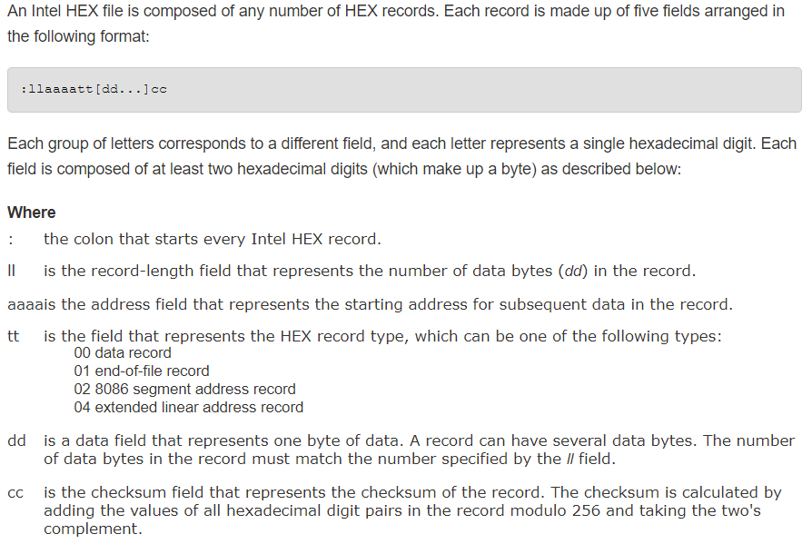
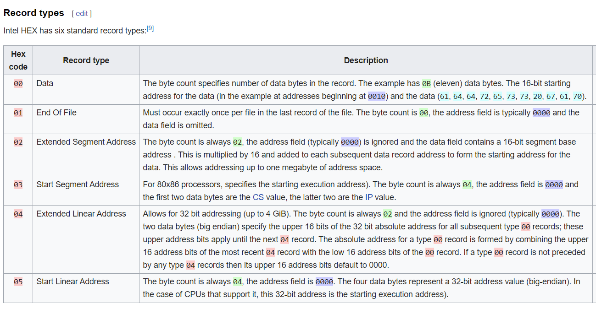

<<<<<<< HEAD
# ABOUT
This is a program used to check whether a file is a hex file or not? If yes, the content will be displayed on terminal (cmd), 25 lines respectively. If there is an error when compiling, it will be showned also.

# WHAT SHOULD YOU KNOW?
- Intel HEX File: The Intel HEX file is an ASCII text file with lines of text that follow the Intel HEX file format

- Format: 

- Data Record: (ll types) 
# ERRORS
- Could not open Hex File.
- Wrong format on specific line.

# REFERENCES
[Wiki](https://en.wikipedia.org/wiki/Intel_HEX) 

[Keli](https://www.keil.com/support/man/docs/oh51/oh51_ih_record.htm)